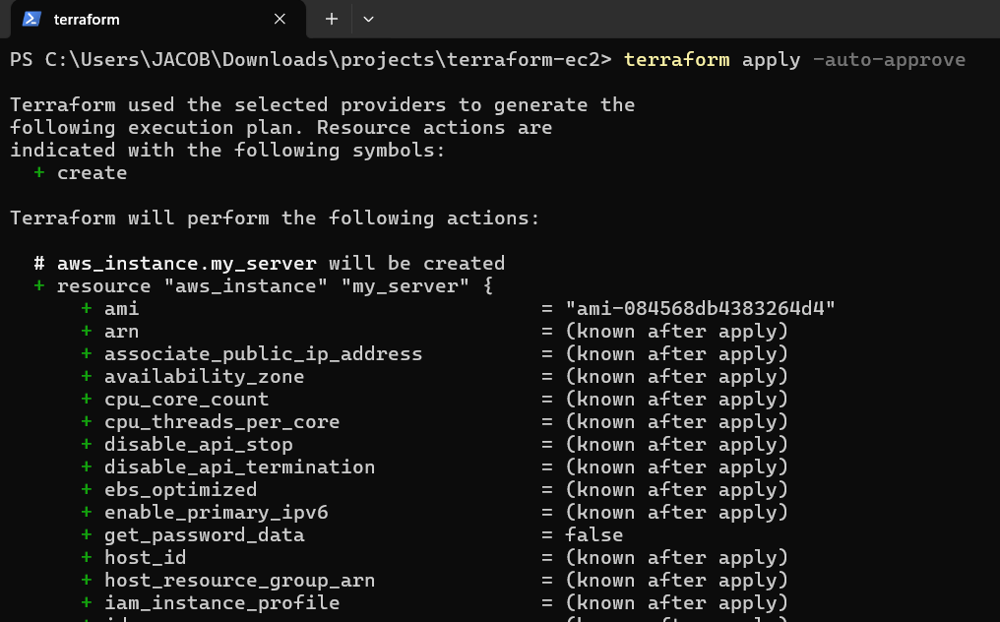
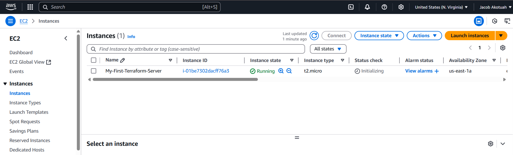
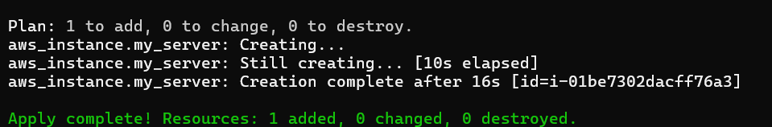

# 🚀 Deploy an EC2 Instance Using Terraform

This project demonstrates how to use **Terraform** to deploy a simple EC2 instance on AWS. It is part of my DevOps Beginner Projects series.

---

## 🎯 Goal

Use code (Terraform) to create and manage an AWS EC2 virtual server (Amazon Linux 2).

---

## 🧰 Prerequisites

- ✅ AWS account (free tier)
- ✅ Terraform installed ([Download here](https://terraform.io))
- ✅ AWS CLI installed ([Install guide](https://docs.aws.amazon.com/cli/latest/userguide/install-cliv2.html))
- ✅ AWS credentials configured using `aws configure`

---

## 📁 Project Setup

```bash
# Create and enter your project directory
mkdir terraform-ec2 && cd terraform-ec2
```

---

## ✍️ Terraform Code (`main.tf`)

```hcl
provider "aws" {
  region = "us-east-1"  # Update to your preferred region
}

resource "aws_instance" "my_server" {
  ami           = "ami-084568db4383264d4"  # Ubuntu Server 24.04 LTS (HVM)
  instance_type = "t2.micro"               # Free tier eligible

  tags = {
    Name = "My-First-Terraform-Server"
  }
}
```

---

## ⚙️ Commands & Steps

### 1⃣ Initialize Terraform

```bash
terraform init
```

### 2⃣ Validate Configuration

```bash
terraform validate
```

### 3⃣ Preview Resources to be Created

```bash
terraform plan
```

### 4⃣ Deploy the EC2 Instance

```bash
terraform apply -auto-approve
```

### ✅ Verify

Go to your [AWS EC2 Console](https://console.aws.amazon.com/ec2/) and check for a running instance tagged **My-First-Terraform-Server**.

### 🧹 Clean Up (Destroy Resources)

```bash
terraform destroy -auto-approve
```

---

## 🗂 .gitignore

```gitignore
# Terraform files to ignore
.terraform/
*.tfstate
*.tfstate.backup
.terraform.lock.hcl
crash.log
override.tf
override.tf.json
*_override.tf
*_override.tf.json
.terraformrc
terraform.rc
```

---

## 🗼 Screenshots

| Terraform Apply Output                    | AWS EC2 Console                      |
| ----------------------------------------- | ------------------------------------ |
|  |  |
| |

---

## 🧠 What I Learned

* How to write basic Terraform configuration files
* Initializing and applying infrastructure as code
* Managing AWS resources using Terraform CLI

---

## 📌 Notes

* Always double-check the region and AMI ID.
* Clean up unused resources to avoid unexpected charges.

---

## 🔗 Related

* [Terraform Documentation](https://developer.hashicorp.com/terraform/docs)
* [AWS Free Tier](https://aws.amazon.com/free)

---

## 🙋‍♂️ Author

**Jacob Akotuah**
📧 [LinkedIn](https://www.linkedin.com/in/jacobakotuah/)
📝 [Dev.to Blog](https://dev.to/jayk)
💻 [GitHub](https://github.com/Jacobjayk)
